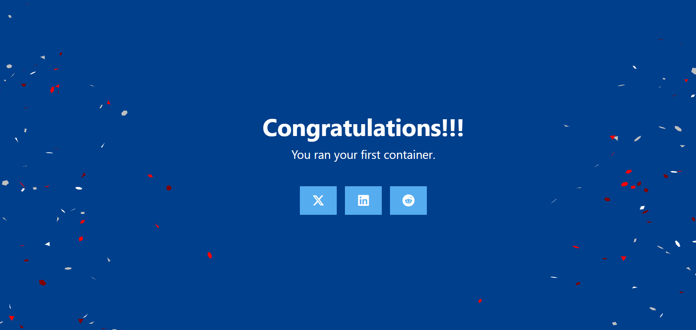
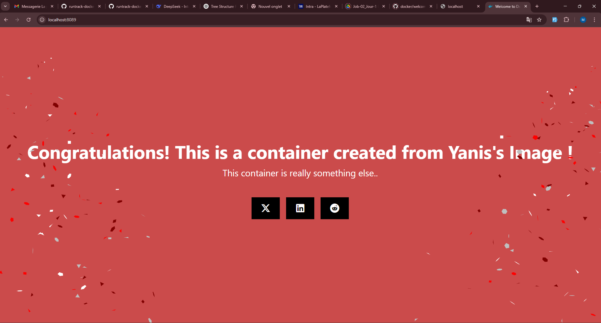
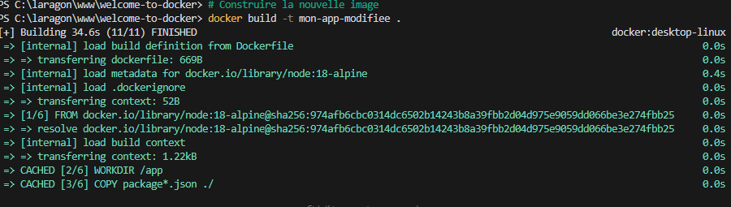
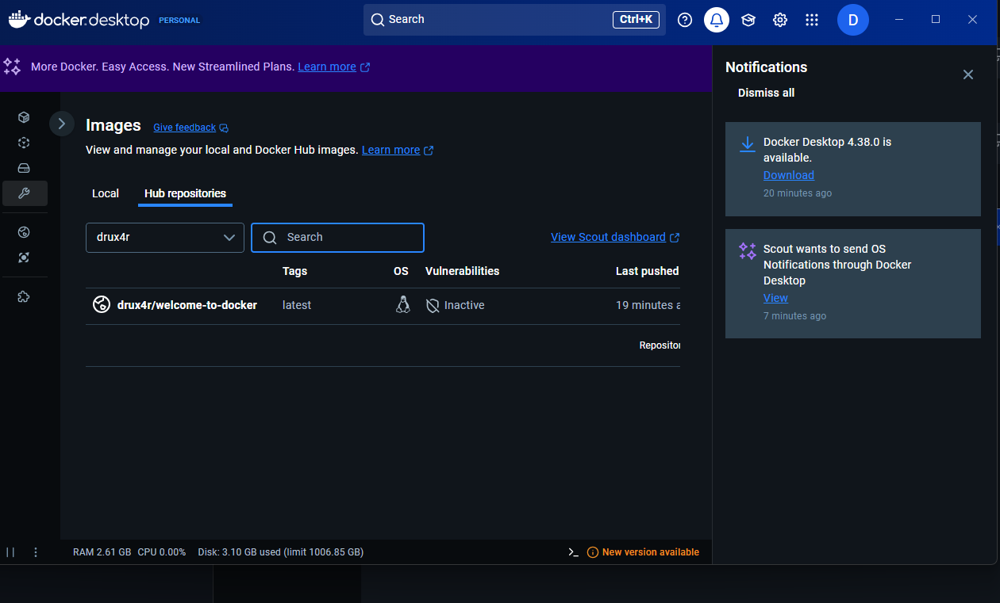
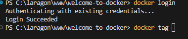

# 📦 Docker Training - Welcome to Docker

This repository documents my journey learning Docker using the [welcome-to-docker](https://github.com/docker/welcome-to-docker) repository.

## 🎯 Objectives
- Learn to use Docker through Visual Studio Code terminal
- Understand and analyze Dockerfile
- Create and manage Docker images and containers
- Make modifications and see them reflected
- Share Docker images through Docker Hub

## 🚀 Getting Started

### Prerequisites
- Docker Desktop installed
- Visual Studio Code
- Git

### Clone the Repository
```bash
git clone https://github.com/docker/welcome-to-docker.git
cd welcome-to-docker
```

## 🛠️ Building Our First Docker Image

### Analyze the Dockerfile
The Dockerfile contains important instructions:
- Uses Node.js 18 Alpine as base image
- Sets up the working directory
- Copies necessary files
- Installs dependencies
- Exposes port 3000
- Runs the application

### Build the Image
```bash
docker build -t welcome-to-docker .
```

### Run the Container
```bash
docker run -d -p 8088:3000 --name welcome-to-docker welcome-to-docker
```

### Verify Container Status
```bash
docker ps
```

Visit `http://localhost:8088` in your browser to see the default blue background page.

## 🎨 Customizing the Application

### Making Changes
I modified the application to personalize it:

1. Located the source files:
   - src/App.js
   - src/App.css

2. Modified the background color and text

### Applying Changes
To see the modifications, we need to:

```bash
# Rebuild the image
docker build -t welcome-to-docker .

# Remove existing container
docker rm -f welcome-to-docker

# Create new container
docker run -d -p 8088:3000 --name welcome-to-docker welcome-to-docker
```

## 🌐 Publishing to Docker Hub

### Login to Docker Hub
```bash
docker login
```

### Tag and Push Image
```bash
# Tag the image
docker tag welcome-to-docker drux4r/welcome-to-docker

# Push to Docker Hub
docker push drux4r/welcome-to-docker
```

## 🤝 Working with Others' Images

### Pull Yanis's Image
```bash
# Pull the image
docker pull yanisb27/welcome-to-docker-yanis

# Run container
docker run -d -p 8089:3000 --name yanis-container yanisb27/welcome-to-docker-yanis
```

### Access and Modify Files
```bash
# Access container shell
docker exec -it yanis-container sh

# List files
ls -R

# Exit container shell
exit

# Copy files locally
docker cp yanis-container:/app/src/App.css ./src/App.css
docker cp yanis-container:/app/src/App.js ./src/App.js
```

### Build and Push Modified Version
```bash
# Build new image
docker build -t derroce/webapp:dev .

# Tag with your username
docker tag derroce/webapp:dev drux4r/webapp:dev

# Push to Docker Hub
docker push drux4r/webapp:dev
```

## 📝 Key Commands Summary
- `docker build -t name .` - Build image
- `docker run -d -p port:port --name container-name image-name` - Run container
- `docker ps` - List running containers
- `docker rm -f container-name` - Remove container
- `docker cp container:source destination` - Copy files from container
- `docker tag source-image target-image` - Tag image
- `docker push image-name` - Push to Docker Hub

## 🙏 Credits
- Original [welcome-to-docker](https://github.com/docker/welcome-to-docker) repository by Docker
- Inspired by Yanis's version (yanisb27)
- Modified and documented by drux4r

## 📸 Screenshots

### Initial Blue Background


### Modified Yellow Background


### Modified Red Background


### Docker Build Process


### Docker Desktop Interface


### Docker Login Success

